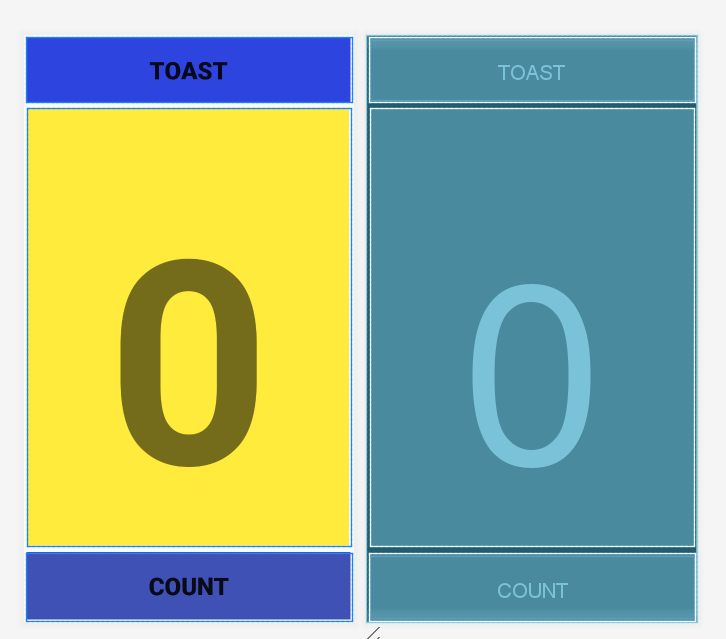
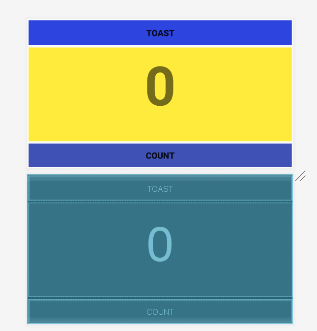

# Toast Counter

**Description :** 

Project from Google's study guide for Associate Android developer certification.

[Linear Layout Based Toast Counter](https://codelabs.developers.google.com/codelabs/android-training-layout-editor-part-a/index.html#0)

An application to Increment counter on the screen With a button click and to view a Toast on an other button click .

**Concepts to be covered :**

>Linear layout to Create graphical user interface.

>Using Layout editor to create user interface.

>Explore Palette, Component Tree, Design Editor , Tool bar for testing the GUI with resources.

>Exploring the properties section in the design editor and using the tool to adjust properties on views.

> Using blue print to understand view boundaries.

###Screenshots for the app Created  

