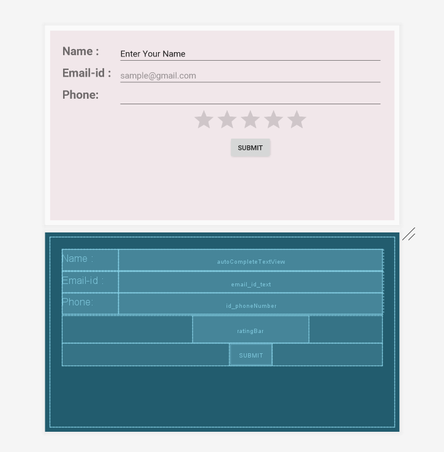
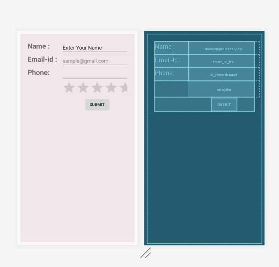

# ReviewForm

**Description :** 

Project to explore Table layout View group

Objective : To Create a form to collect details and submit review.

**Concepts to be covered :**

>Table Layout to create graphical user Interface.

>Understanding cells to arrange views

>Rows & columns for positioning the views 

>How this layout can be handy for form creation

###Screenshots for the app Created  

