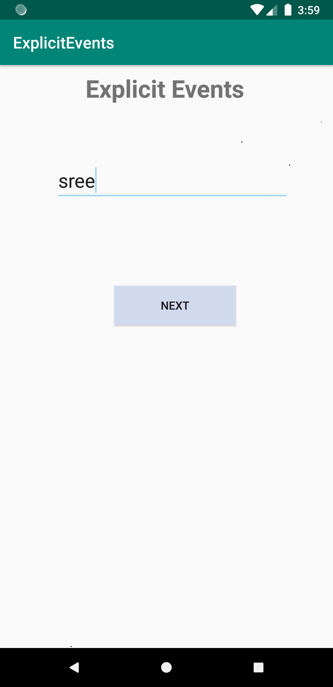

# Intents

The concept of explicit intents is explored as a part of this project.

**Take Away :**

* Intents can be explicit or implicit basing on the source and destination clarity in the project.

* Explicit intents is used to navigate between the activities with in the application as source and destination will be clear

* How ever android stacks activities in an application so if user chooses to go back the activities will be unfolded as like in the order they were inserted

* If developer wants to implement an explicit order in navigating back that can be configured with parent - child relation ship between activities

  **Passing the Data :**
  
* Intents can be used to pass the data as key value bundles

* Intents also support to pass data like url and telephone numbers which will be explicit intents if you have only one compatible apps in your mobile

**Screen shots For Output :**

