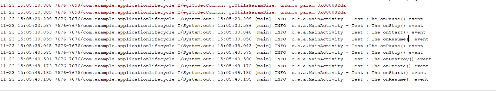

# Application Life Cycle

Concepts to be explored 

> States of an Activity 

> Transitions between the states in an activity with the user action with the application

Output :

Summary or Take away :

> When an application is opened ; on create() ; on Start () ; on Resume() will be called sequentially 

> With onResume() ; application will be on fore ground to the user

> When user pushes the activity to back-ground with back onPause() onStop() and on Destroy() will be called sequentially resulting activity shut down.

> When user pushes the activity to back-ground with home button Current activity will be pushed to onPause() and onStop() and with further request form the user tha activity can be restarted from OnStart(). 

